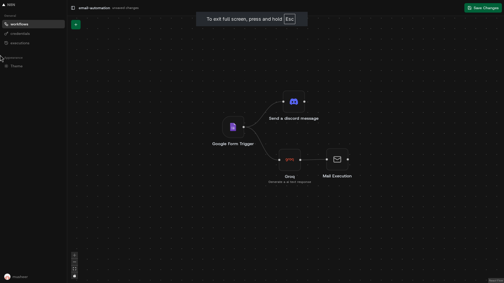

# Mini Automation Engine
<p align="center">
  
</p>

> A **small, opinionated workflow automation engine** built with Next.js.
> Think: *n8n / Zapier*, but **linear only**, no loops, no branching hell.

This project lets you create workflows made of **triggers** (manual, webhook, Google Form, HTTP) and **executors** (Discord, Gemini, Groq, SMTP, HTTP, etc.), then executes them **step‑by‑step** using a **topological sort**.

If the workflow is **not linear** (cycles / loops / weird graphs), it **fails fast**. No magic. No pretending.

---

## 🚨 Important Limitations (Read This First)

This is **not a full n8n clone**.

* ❌ No loops
* ❌ No conditional branching
* ❌ No parallel execution
* ❌ Cyclic graphs = error / undefined behavior

Only this is supported:

```
Trigger → Executor → Executor → Executor
```

Why?

* Simpler mental model
* Easier debugging
* Predictable execution
* Perfect for learning **workflow engines + orchestration**

---

## 🧠 Core Idea (Explainable in 30 seconds)

1. A workflow is a **graph of nodes**
2. Nodes are either:

   * **Triggers** → start the workflow
   * **Executors** → do work
3. The graph is **topologically sorted**
4. Nodes are executed **one by one** in order
5. If the graph has a cycle → ❌ error

That’s it

---

## 🧱 Tech Stack

### Frontend

* **Next.js (App Router)**
* **React**
* **TypeScript**
* **shadcn/ui**

### Backend

* **tRPC** – typed API layer
* **Inngest** – background workflow execution
* **Drizzle ORM** – database schema & queries
* **PostgreSQL** – main database
* **Redis** – caching + execution state

### Infra / Other

* **pnpm** – package manager
* **Zod** – runtime validation

---

## 📁 High‑Level Architecture

```
User Action / Webhook
        ↓
Trigger Node
        ↓
Topological Sort (linear order)
        ↓
Executor 1
        ↓
Executor 2
        ↓
Executor N
```

### Why Topological Sort?

Topological sort means:

> “Give me an order where every node runs **after** its dependencies.”

If a loop exists:

```
A → B → C → A
```

Topological sort **fails** → workflow rejected.

That’s how this project enforces *linear automation only*.

---

## 🗂️ Folder Structure (Simplified)

```
src/
 ├─ app/            # Next.js routes & pages
 ├─ features/       # Feature‑based UI + logic
 ├─ executors/      # Server‑side executor logic
 ├─ inngest/        # Workflow execution engine
 ├─ trpc/           # API layer
 ├─ db/             # Database + types
 ├─ redis/          # Cache helpers
 └─ components/     # Shared UI components
```

---

## 🔁 How Workflow Execution Works

1. **Trigger fires**

   * Manual click / webhook / Google Form

2. **Workflow graph loaded**

   * Nodes + edges from DB

3. **Topological sort runs**

   * Converts graph → ordered list

4. **Inngest executes nodes**

   * One node at a time
   * Each executor receives input from the previous node

5. **Execution status stored**

   * Redis + DB

---

## 🧩 Node Types

### Triggers

* `manual`
* `http`
* `webhook`
* `googleForm`

### Executors

* `discord`
* `smpt_mail`
* `http`
* `gemini`
* `groq`

---

## 🧪 Database Enums (Very Important)

Whenever you add a **new trigger or executor**, you **must** update these:

```ts
export const NodeTypeDb = pgEnum("node_type", [
  "manual",
  "http",
  "googleForm",
  "smpt_mail",
  "discord",
  "webhook",
  "gemini",
  "groq",
])

export const CredentialsTypeDb = pgEnum("credentialsType", [
  "gemini",
  "smpt.gmail",
  "groq",
])
```

If you don’t → runtime sadness.

---

## ➕ Adding a New Executor (Example: Gmail Executor)

### 1️⃣ Create Server Executor

```
src/executors/gmail-executor/
 ├─ executor.ts
 ├─ schema.ts
 └─ utils.ts (optional)
```

* `executor.ts` → actual execution logic
* `schema.ts` → Zod validation for config

---

### 2️⃣ Register Executor (Server)

In:

```
src/executors/executor-registry.ts
```

Add your executor:

```ts
export const executors:executors = {
   ...others
    "gmail":MailSenderExecutor,

}
```

This is what allows the backend to **run** it.

---

### 3️⃣ Add UI Node

```
src/features/nodes/components/executers/gmail-executor/
 ├─ gmail-node.tsx
 └─ gmail-settings.tsx
```

This controls how the node looks and how users configure it.

---

### 4️⃣ Register UI Node

In:

```
src/features/nodes/registery.ts
```

Add your node mapping:

```ts
"gmail": GmailNode
```

---

### 5️⃣ Add to Node Selector

There is an **array** used to render available nodes.
Add your new executor there.

If it’s not in the array → it won’t show up in the UI.

---

### 6️⃣ Update Database Enums

```ts
NodeTypeDb → add "gmail"
CredentialsTypeDb → add credential type if needed
```

Run migrations.

---

## ➕ Adding a New Trigger (Example: Google Form)

Steps are **almost identical**:

1. Create executor under `executors/`
2. Create UI node under `features/nodes/components/triggers/`
3. Register in:

   * executor registry (server)
   * UI registry
4. Add to node selector array
5. Update `NodeTypeDb`

Triggers just **start** workflows instead of receiving input.

---

## 🧠 Mental Model (How to Explain This in Interviews)

> “This is a linear workflow engine.
> Users build workflows as a graph, but before execution the graph is topologically sorted.
> Only DAGs without cycles are allowed, which guarantees predictable step‑by‑step execution.
> Each node is a plugin‑style executor registered both on the server and UI layer.”

That sentence alone carries.

---

## ⚠️ Why This Project Exists

* Learn workflow orchestration
* Practice plugin architectures
* Avoid over‑engineering

This is **intentionally constrained**.

---

## 🛠️ Future Improvements (Optional)

* Conditional nodes
* Parallel execution
* Retry policies per node
* Better cycle detection errors
* Versioned workflows

---

## 🧑‍💻 Author Notes

This project is built for **learning and clarity**, not feature‑parity with n8n.

If something breaks when you add a loop — that’s by design 😄

---

## 🧾 License

MIT (or whatever you want)
